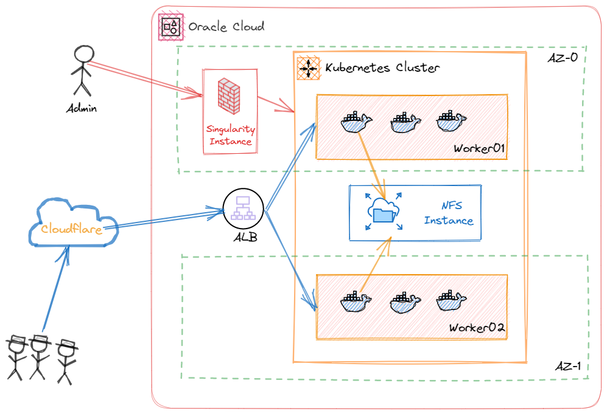

# For
This is the code to deploy K8S infra on Oracle cloud using Always Free resources

# Diagram

# Traffic flow
- User access via Cloudflare to LB and then to K8S
- K8S Persistent Volumes provided by NFS instance to allow a single 50GB disk shared with multi containers.
- All management traffic must route through bastion (Singularity) instance.
- No public access to K8S.